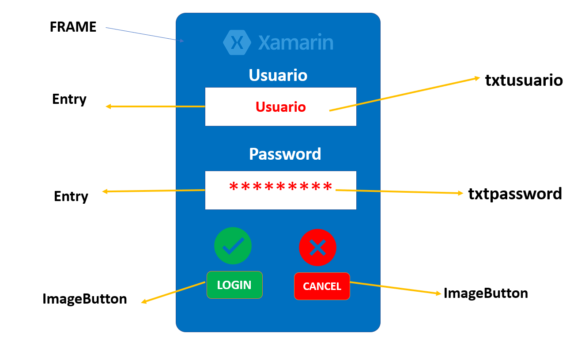

# LOGIN_BASICO_XAMARIN
LOGIN_BASICO_XAMARIN
####
Xamarin.Forms cuenta con una gran cantidad de controles predefinidos que podemos utilizar para crear las interfaces de usuario de nuestras aplicaciones.

###
Vamos a crear un Login con Xamarin forms, con algunos controles como StackLayout, Label,  
Entry, Image, Button, Eventos, y Codigo C# y compararlo para abrir Navigation Page

### ✔ No te olvides de Seguirme en mis Redes Sociales:

#### 0-🎬 Youtube:https://www.youtube.com/watch?v=Kj4CMgA4sBI
#### 1-👨‍💼 LinkedIn: https://www.linkedin.com/in/juancitop...
#### 2-📰 Blog: https://advisertecnology.com/
#### 3-📷 Instagram: https://www.instagram.com/juancito.pe...
#### 4-📑 Facebook: https://www.facebook.com/juancito.p.v​
#### 5-🐦 Twitter: https://twitter.com/JuancitoPenaV​

